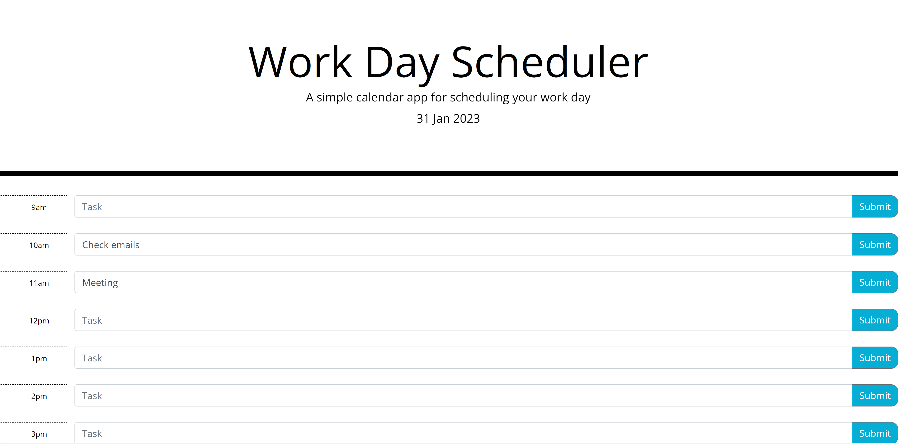

# 7. Work scheduler
To create a work scheduler where tasks can be saved,

## Description

* Display the current day at the top of the calender when a user opens the planner.

* Present timeblocks for standard business hours when the user scrolls down.
 
* Color-code each timeblock based on past, present, and future when the timeblock is viewed.
 
* Allow a user to enter an event when they click a timeblock

* Save the event in local storage when the save button is clicked in that timeblock.

## Installation
Code was built on Visual Studio Code.
Click on following link to view website and github repository. Contains HTML, css styling and javascript file, and images in afolder.

## Usage
Enter tasks into time block and click submit to save.

## Deployment link:
[Completed challenge] (https://mtruong1995.github.io/work-day-scheduler/)

## Repo link:
[Repository] (https://github.com/mtruong1995/work-day-scheduler)

## Screenshot:

## Credit

-With help from https://fantastic-pudding.vercel.app/ and Drew from edx Web development course.
-jquery
-bootstrap
